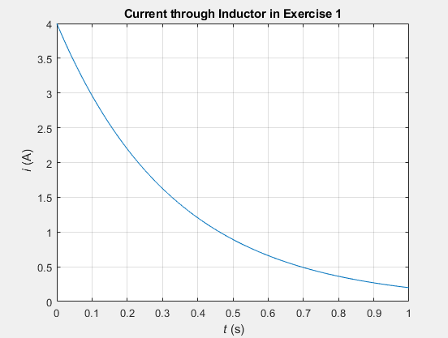
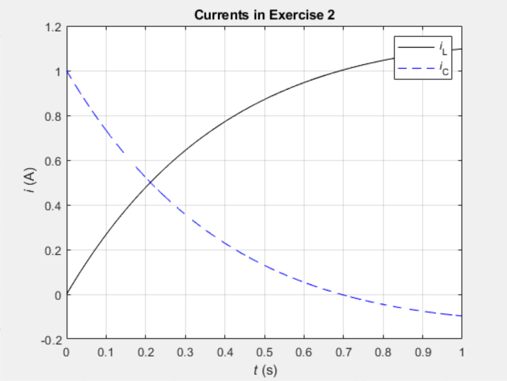
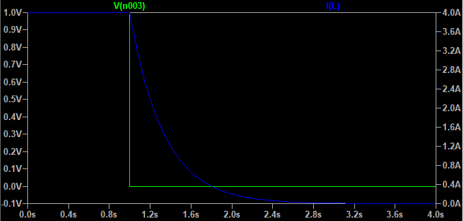
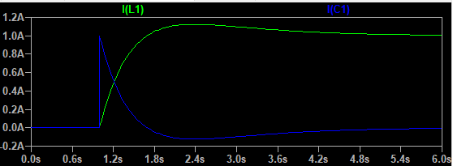
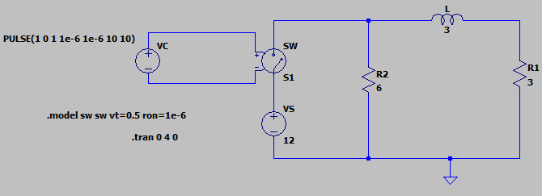
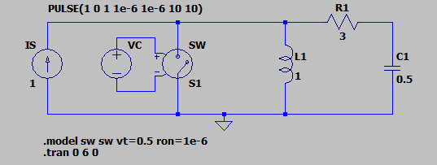

# Transient-Analysis-with-Laplace-Transform

#### using LTspice and MATLAB to carry out analysis of transient circuits, and using the Laplace transform to analyze transient circuits in the s-domain.

So far, steady-state analysis of circuits in: (i) DC regime, and (ii) AC (harmonic, sinusoidal) regime has been carried out. However, inevitably, there is a start and a stop to a steady-state regime – what happens then?

Transient circuit analysis deals with the “switching” regimes of circuit operation and employs the Laplace transform (or s-domain) method. This was an experiment conducted to verify these properties in transient circuits by obtaining computational findings plotted in MATLAB and comparing them with plots obtained from simulated circuits with the same parameters.

The following MATLAB plots based on LT computations:

  
    

Agreed with their respective LTSpice simulation plots below, designed based on the transient circuits provided in the report:

  
    

These results were obtained from the following first and second order RC and RLC circuits:

  
    

